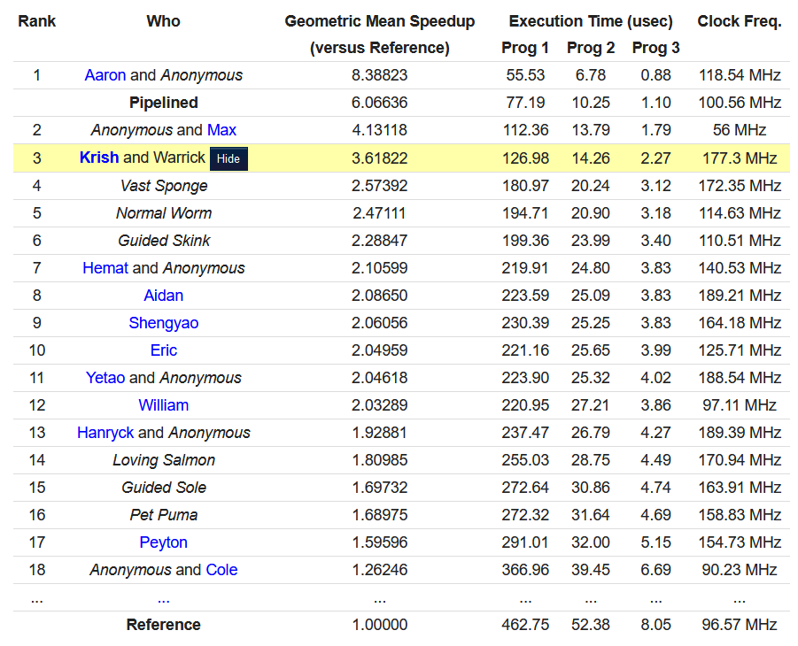

# RISC-V Machine Source Code for CPU Competition

This repository contains the RISC-V machine source code used in the CPEN 211 CPU competition held at the end of the semester.

## Performance Overview
- **Main Branch**: Achieves **maximum 5 cycles per instruction**.
- **Competition Results**: Ranked **3rd place** in terms of:
  - Efficiency to compute multiple instructions.
  - Maximum clock frequency achieved.
  - Geometric Mean Speedup (compared to the unoptimized reference version).
- **Pipelined Branch**: An experimental version of the RISC machine with pipelining is available in the `pipelined` branch. Although not fully debugged, it is theoretically **2-3x faster** than the current implementation.

### Final Ranking and Scores

---

## Build Instructions
The RISC machine is developed with:
- **Quartus Prime 18.1**
- **ModelSim 10.5b**

It has been tested on the **Cyclone-V FPGA** using the **DE1-SoC** development board. While other Verilog tools and FPGAs may work, modifications to the top module and pin assignments may be required.

### Build Process
1. Add all `.sv` files to your project.
2. Set `lab7bonus_top` as your top module.
3. Create or modify `data.txt` to initialize system RAM.

---

## Important Note
This work is the property of **Krish Thakur** and **Warrick Lo**. It **MUST NOT** be copied or reused in any form. Furthermore, this code will no longer function on any version of the CPEN 211 autograder.

